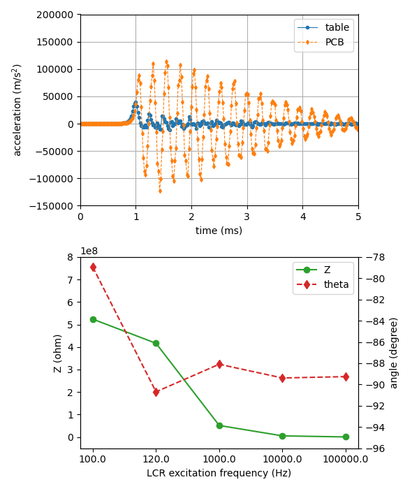

# [Dataset 2](./data-1)

Dataset 2 consists of 32 tests performed May 5 2023. Tests were performed consecutively on the same PCB. Following each impact test, impedance was measured at five LCR excitation frequencies. The folder also contains a python file with a demonstration for extracting data from the .lvm files and plotting, and figures plotting the acceleration and measured impedance.

  
(above) Time series acceleration of table and PCB and (below) impedance magnitude and angle measured at five excitation frequencies.

Due to a data acquisition error, test numbers 17 and 24 recorded incorrect acceleration data.
